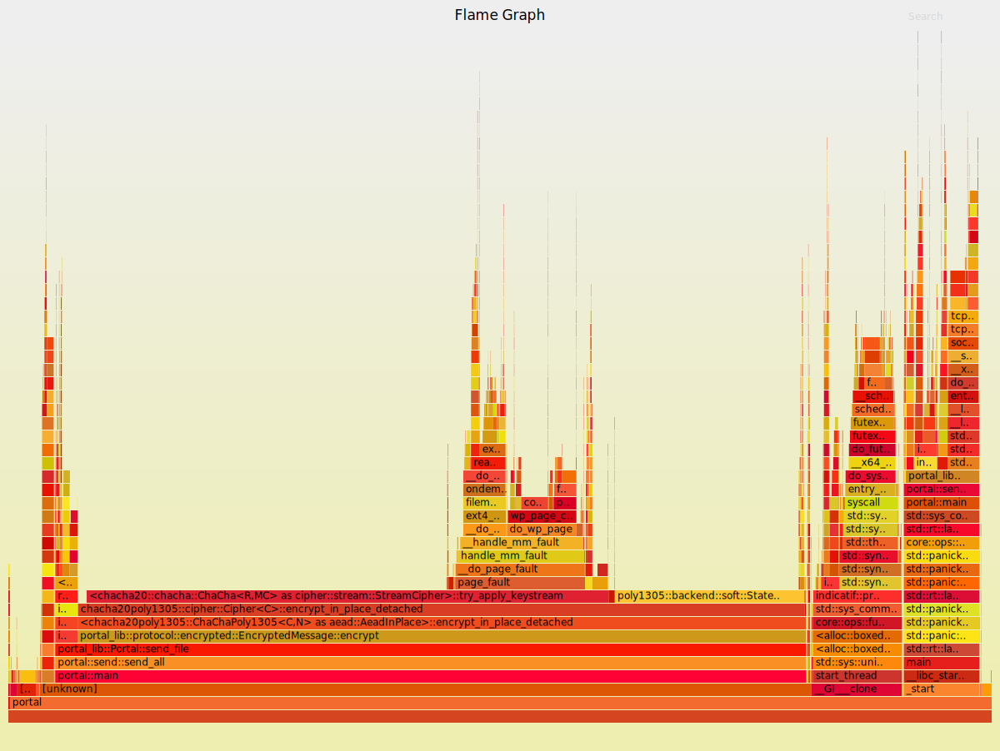

[![cargo-badge-lib][]][cargo-lib] [![docs-badge-lib][]][docs-lib] [![license-badge][]][license] [![rust-version-badge][]][rust-version] [![build][]][build-url] [![codecov][]][codecov-url]  

[Portal](https://github.com/landhb/portal) is an encrypted file transfer utility, written in Rust with an accompanying protocol library and relay.

## Features

- Transfer files to any peer as long as both can connect to the same portal relay
- Optional Ring backend for Chacha20-Poly1305 (default is RustCrypto)
- Library to programatically interact via the portal protocol
- Linux, MacOS, and Windows client support

### CLI Application

Easily transfer multiple files or directories via CLI:

```sh
portal send /etc/passwd ./files/
```

Your peer will enter an equivalent command on the other side:


```sh
portal recv
```

Note: The default relay is `portal-relay.landhb.dev`. Your peer must connect to the same portal-relay as you. You can also host your own relay and change the value to any domain/IP address in your config.

### Performance & Benchmarks

Currently only the performance of `Portal::send_file` and `Portal::recv_file` are tracked automatically for various file sizes. The benchmarks for the `master` branch can be found [here](bench/).

In the future we'd like to compare the RustCrypto Chacha20-Poly1305 implementation versus Ring's implementation. Initial tests seemed to show Ring's may be faster. Currently a significant amount of time is spent encrypting/decrypting, as shown below in the flamegraph collected from sending a 366MB file (clicking on the svg will allow you to interactively explore it):

<a href="./images/send_flamegraph.svg"></a>

### Library

The library crate enables a user to programatically: 

- Create/serialize/deserialize Portal request/response messages.
- Negoticate a symmetric key with a peer using [SPAKE2](https://docs.rs/spake2/0.2.0/spake2) 
- Encrypt files with [Chacha20-Poly1305](https://blog.cloudflare.com/it-takes-two-to-chacha-poly/) using either the [RustCrypto](https://docs.rs/chacha20poly1305) implementation or [Ring's](https://briansmith.org/rustdoc/ring/aead/index.html)
- Send/receive files through a Portal relay

The library is broken up into two abstractions:

- [`Portal`](https://docs.rs/portal-lib/latest/portal_lib/struct.Portal.html) a higher level API, to facilitate automating transfers easily
- [`Protocol`](https://docs.rs/portal-lib/latest/portal_lib/protocol/struct.Protocol.html) a lower-level API, if you need access to lower-level facilities


Example of sending a file with the higher-level abstraction:

```rust
use std::path::Path;
use std::error::Error;
use std::net::TcpStream;
use portal_lib::{Portal, Direction, TransferInfoBuilder};

fn my_send() -> Result<(), Box<dyn Error>> {

    // Securely generate/exchange ID & Password with peer out-of-band
    let id = String::from("id");
    let password = String::from("password");

    // Connect to the relay - the ID will be used to connect the peers
    let mut portal = Portal::init(Direction::Sender, id, password)?;
    let mut stream = TcpStream::connect("127.0.0.1:34254")?;

    // The handshake must be performed first, otherwise
    // there is no shared key to encrypt the file with
    portal.handshake(&mut stream)?;

    // Add any files/directories
    let info = TransferInfoBuilder::new()
        .add_file(Path::new("/etc/passwd"))?
        .finalize();

    // Optional: implement a custom callback to display how much
    // has been transferred
    fn progress(transferred: usize) {
       println!("sent {:?} bytes", transferred);
    }

    // Send every file in TransferInfo
    for (fullpath, metadata) in portal.outgoing(&mut stream, &info)? {
        portal.send_file(&mut stream, fullpath, Some(progress))?;
    }
    Ok(())
}
```

[//]: # (badges)
[license-badge]: https://img.shields.io/badge/license-MIT/Apache--2.0-lightgray.svg?style=flat-square
[license]: #license
[rust-version-badge]: https://img.shields.io/badge/rust-latest%20stable-blue.svg?style=flat-square
[rust-version]: #rust-version-policy

[cargo-badge-relay]: https://img.shields.io/crates/v/portal-relay.svg?style=flat-square&label=portal-relay
[cargo-relay]: https://crates.io/crates/portal-relay
[cargo-badge-client]: https://img.shields.io/crates/v/portal-client.svg?style=flat-square&label=portal-client
[cargo-client]: https://crates.io/crates/portal-client
[cargo-badge-lib]: https://img.shields.io/crates/v/portal-lib.svg?style=flat-square&label=portal-lib
[cargo-lib]: https://crates.io/crates/portal-lib

[docs-badge-client]: https://docs.rs/portal-client/badge.svg?style=flat-square
[docs-client]: https://docs.rs/portal-client
[docs-badge-lib]: https://docs.rs/portal-lib/badge.svg?style=flat-square
[docs-lib]: https://docs.rs/portal-lib

[codecov]: https://img.shields.io/codecov/c/github/landhb/portal?style=flat-square
[codecov-url]: https://codecov.io/gh/landhb/portal

[build]: https://img.shields.io/github/workflow/status/landhb/portal/Build/master?style=flat-square
[build-url]: https://github.com/landhb/portal/actions?query=workflow%3ABuild
